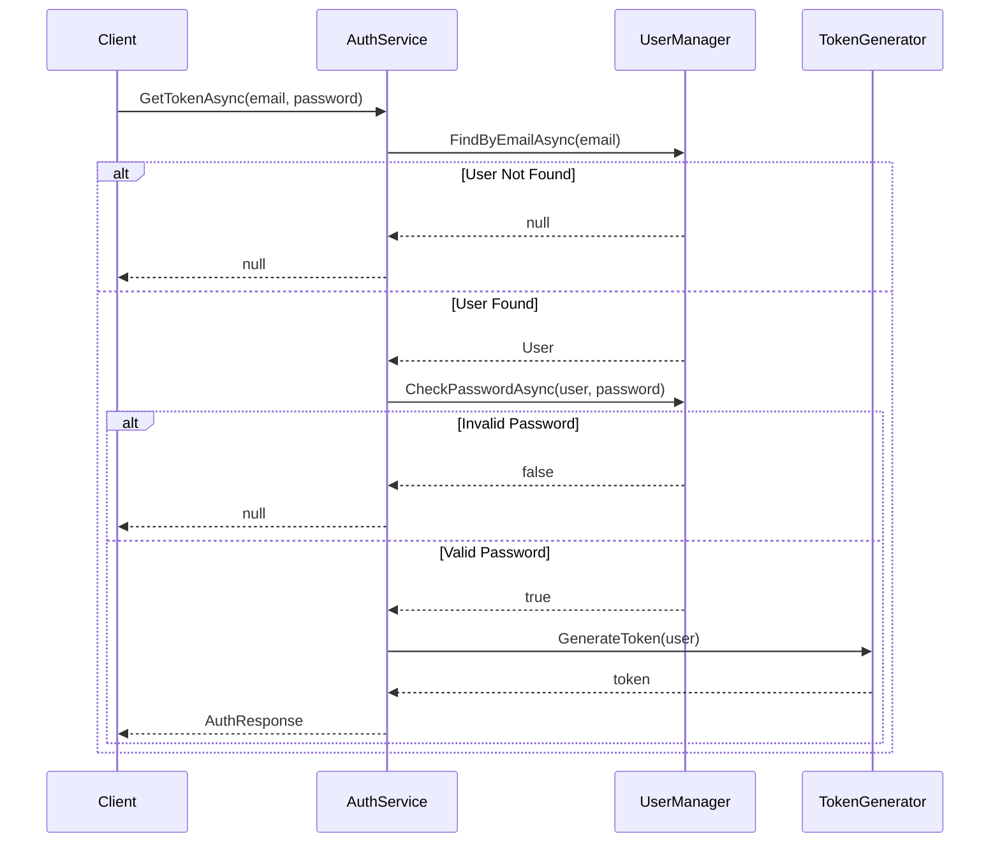

# Authentication Service Implementation Guide

## Overview
This guide covers the implementation of a custom authentication service that handles JWT token generation for user login. We'll build this step by step, from interfaces to concrete implementations.

## Project Structure

```plaintext
YourProject/
├── Services/
│   ├── Interfaces/
│   │   └── IAuthService.cs
│   └── AuthService.cs
└── Contracts/
    └── Authentication/
        └── AuthResponse.cs
```

## 1. Authentication Response Model
Define the structure for authentication response:

```csharp
public record AuthResponse(
    string Id,
    string? Email,
    string FirstName,
    string LastName,
    string Token,
    int ExpiresIn
);
```

## 2. Authentication Service Interface
Define the contract for authentication operations:

```csharp
public interface IAuthService
{
    Task<AuthResponse?> GetTokenAsync(
        string email,
        string password,
        CancellationToken cancellationToken = default
    );
}
```

## 3. Authentication Service Implementation

```csharp
public class AuthService : IAuthService
{
    private readonly UserManager<ApplicationUser> _userManager;

    public AuthService(UserManager<ApplicationUser> userManager)
    {
        _userManager = userManager;
    }

    public async Task<AuthResponse?> GetTokenAsync(
        string email, 
        string password, 
        CancellationToken cancellationToken = default)
    {
        // 1. Check if user exists
        var user = await _userManager.FindByEmailAsync(email);
        if (user is null)
            return null;

        // 2. Validate password
        var isValidPassword = await _userManager.CheckPasswordAsync(user, password);
        if (!isValidPassword)
            return null;

        // 3. Generate JWT Token (placeholder for now)
        return new AuthResponse(
            Guid.NewGuid().ToString(),
            "test@test.com",
            "Moemen",
            "Mohammad",
            "eyghBGCFAASFSFAFSFAFA",
            3600
        );
    }
}
```

## 4. Service Registration
Add the authentication service to the dependency injection container:

```csharp
services.AddScoped<IAuthService, AuthService>();
```

## Authentication Flow



## Implementation Notes

### 1. User Manager Benefits
- Built-in methods for user operations
- Handles password hashing and verification
- Supports claims and role management
- Email/username validation

### 2. Authentication Service Features
- Null-safe implementation
- Async operations
- Cancellation token support
- Clean separation of concerns

### 3. Pending Implementations
- JWT token generation
- Token expiration handling
- Refresh token mechanism
- Error handling middleware

## Next Steps

1. **Controller Implementation**
   - Create authentication controller
   - Define login endpoint
   - Add request validation

2. **Request Validation**
   - Create login request model
   - Implement request validator
   - Add validation middleware

3. **JWT Configuration**
   - Configure JWT settings
   - Implement token generation
   - Add token validation

## Best Practices

1. **Security**
   - Use asynchronous methods
   - Implement proper password validation
   - Handle null cases explicitly

2. **Code Organization**
   - Follow SOLID principles
   - Use dependency injection
   - Maintain clean separation of concerns

3. **Error Handling**
   - Implement proper logging
   - Return appropriate status codes
   - Handle edge cases

## Code Snippets

### Example Login Request Model (To Be Implemented)
```csharp
public record LoginRequest(
    string Email,
    string Password
);
```

### Example Validator (To Be Implemented)
```csharp
public class LoginRequestValidator : AbstractValidator<LoginRequest>
{
    public LoginRequestValidator()
    {
        RuleFor(x => x.Email)
            .NotEmpty()
            .EmailAddress();

        RuleFor(x => x.Password)
            .NotEmpty()
            .MinimumLength(8);
    }
}
```

This implementation provides a foundation for a secure authentication system. The next phase will involve creating the controller and implementing the JWT token generation logic.

Would you like me to expand on any part of this documentation or add additional sections?
