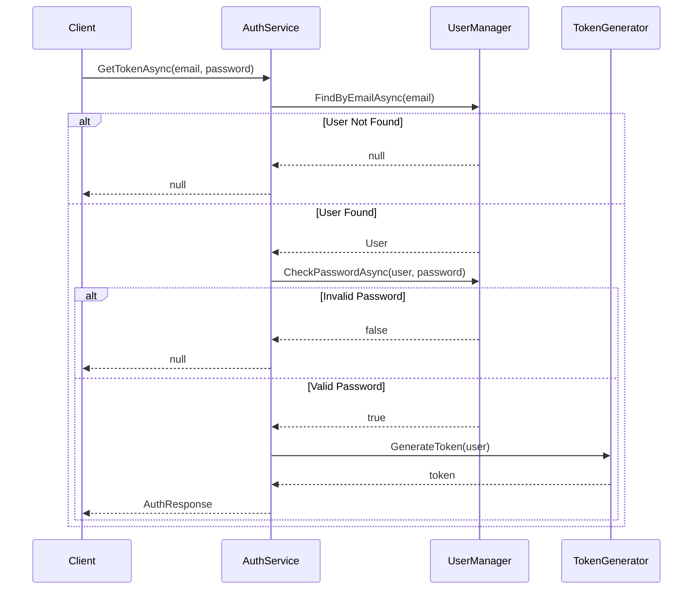
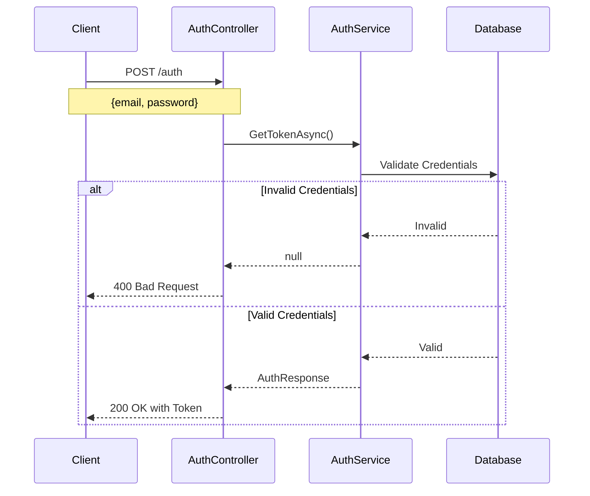
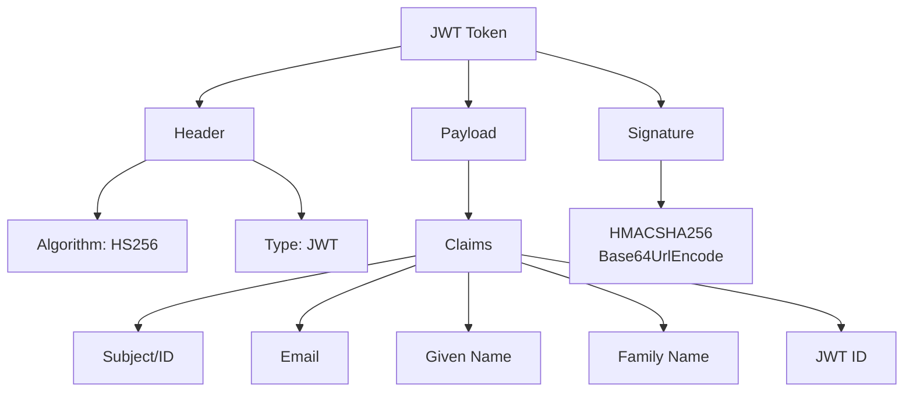

# Authentication Service Implementation Guide

## Overview
This guide covers the implementation of a custom authentication service that handles JWT token generation for user login. We'll build this step by step, from interfaces to concrete implementations.

## Project Structure

```plaintext
YourProject/
├── Services/
│   ├── Interfaces/
│   │   └── IAuthService.cs
│   └── AuthService.cs
└── Contracts/
    └── Authentication/
        └── AuthResponse.cs
```

## 1. Authentication Response Model
Define the structure for authentication response:

```csharp
public record AuthResponse(
    string Id,
    string? Email,
    string FirstName,
    string LastName,
    string Token,
    int ExpiresIn
);
```

## 2. Authentication Service Interface
Define the contract for authentication operations:

```csharp
public interface IAuthService
{
    Task<AuthResponse?> GetTokenAsync(
        string email,
        string password,
        CancellationToken cancellationToken = default
    );
}
```

## 3. Authentication Service Implementation

```csharp
public class AuthService : IAuthService
{
    private readonly UserManager<ApplicationUser> _userManager;

    public AuthService(UserManager<ApplicationUser> userManager)
    {
        _userManager = userManager;
    }

    public async Task<AuthResponse?> GetTokenAsync(
        string email, 
        string password, 
        CancellationToken cancellationToken = default)
    {
        // 1. Check if user exists
        var user = await _userManager.FindByEmailAsync(email);
        if (user is null)
            return null;

        // 2. Validate password
        var isValidPassword = await _userManager.CheckPasswordAsync(user, password);
        if (!isValidPassword)
            return null;

        // 3. Generate JWT Token (placeholder for now)
        return new AuthResponse(
            Guid.NewGuid().ToString(),
            "test@test.com",
            "Moemen",
            "Mohammad",
            "eyghBGCFAASFSFAFSFAFA",
            3600
        );
    }
}
```

## 4. Service Registration
Add the authentication service to the dependency injection container:

```csharp
services.AddScoped<IAuthService, AuthService>();
```

## Authentication Flow



## Implementation Notes

### 1. User Manager Benefits
- Built-in methods for user operations
- Handles password hashing and verification
- Supports claims and role management
- Email/username validation

### 2. Authentication Service Features
- Null-safe implementation
- Async operations
- Cancellation token support
- Clean separation of concerns

### 3. Pending Implementations
- JWT token generation
- Token expiration handling
- Refresh token mechanism
- Error handling middleware

## Next Steps

1. **Controller Implementation**
   - Create authentication controller
   - Define login endpoint
   - Add request validation

2. **Request Validation**
   - Create login request model
   - Implement request validator
   - Add validation middleware

3. **JWT Configuration**
   - Configure JWT settings
   - Implement token generation
   - Add token validation

## Best Practices

1. **Security**
   - Use asynchronous methods
   - Implement proper password validation
   - Handle null cases explicitly

2. **Code Organization**
   - Follow SOLID principles
   - Use dependency injection
   - Maintain clean separation of concerns

3. **Error Handling**
   - Implement proper logging
   - Return appropriate status codes
   - Handle edge cases

## Code Snippets

### Example Login Request Model (To Be Implemented)
```csharp
public record LoginRequest(
    string Email,
    string Password
);
```

### Example Validator (To Be Implemented)
```csharp
public class LoginRequestValidator : AbstractValidator<LoginRequest>
{
    public LoginRequestValidator()
    {
        RuleFor(x => x.Email)
            .NotEmpty()
            .EmailAddress();

        RuleFor(x => x.Password)
            .NotEmpty()
            .MinimumLength(8);
    }
}
```

This implementation provides a foundation for a secure authentication system. The next phase will involve creating the controller and implementing the JWT token generation logic.

# Authentication Controller Implementation Guide

## Overview
This guide covers the implementation of an authentication controller for handling JWT token generation through a secure login endpoint.

## Project Structure
```plaintext
YourProject/
├── Controllers/
│   └── AuthController.cs
├── Contracts/
│   └── Authentication/
│       ├── LoginRequest.cs
│       └── LoginRequestValidator.cs
└── Configuration/
    └── DependencyInjection.cs
```

## 1. Authentication Controller
```csharp
[Route("auth")]
public class AuthController : ControllerBase
{
    private readonly IAuthService _authService;

    public AuthController(IAuthService authService)
    {
        _authService = authService;
    }

    [HttpPost("")]
    public async Task<IActionResult> LoginAsync(
        LoginRequest request,
        CancellationToken cancellationToken)
    {
        var authResult = await _authService.GetTokenAsync(
            request.Email,
            request.Password,
            cancellationToken);

        return authResult is null 
            ? BadRequest("Invalid email or password")
            : Ok(authResult);
    }
}
```

## 2. Login Request Models

### Request Model
```csharp
public record LoginRequest(
    string Email,
    string Password
);
```

### Request Validator
```csharp
public class LoginRequestValidator : AbstractValidator<LoginRequest>
{
    public LoginRequestValidator()
    {
        RuleFor(x => x.Email)
            .NotEmpty()
            .EmailAddress();

        RuleFor(x => x.Password)
            .NotEmpty()
            .MinimumLength(8);
    }
}
```

## 3. Dependency Injection Configuration

```csharp
public static class DependencyInjection
{
    public static IServiceCollection AddDependencies(
        this IServiceCollection services,
        IConfiguration configuration)
    {
        services.AddControllers();
        services.AddAuthConfig();

        var connectionString = configuration.GetConnectionString("DefaultConnection") 
            ?? throw new InvalidOperationException(
                "Connection string 'DefaultConnection' not found.");

        services.AddDbContext<ApplicationDbContext>(options => 
            options.UseSqlServer(connectionString));

        services.AddSwaggerServices()
                .AddMapsterConfig()
                .AddFluentValidationConfig();

        services.AddScoped<IAuthService, AuthService>();
        services.AddScoped<IPollService, PollService>();

        return services;
    }

    private static IServiceCollection AddAuthConfig(
        this IServiceCollection services)
    {
        services.AddIdentity<ApplicationUser, IdentityRole>()
                .AddEntityFrameworkStores<ApplicationDbContext>();
        return services;
    }
}
```

## Authentication Flow



## Security Considerations

### 1. Endpoint Security
- Uses POST method for secure data transmission
- Credentials sent in request body, not query string
- Implements input validation
- Returns appropriate status codes

### 2. Request Validation
- Email format validation
- Password minimum length requirement
- Required field validation
- Custom error messages

## API Endpoint Details

| Aspect | Detail |
|--------|---------|
| Route | `/auth` |
| Method | POST |
| Request Body | `LoginRequest` |
| Success Response | 200 OK with `AuthResponse` |
| Error Response | 400 Bad Request |

## Implementation Notes

1. **Controller Design**
   - Minimal route configuration (`/auth`)
   - Clean dependency injection
   - Async/await pattern
   - Cancellation token support

2. **Request Handling**
   - Record type for immutable request data
   - Fluent validation for request validation
   - Clear error messages

3. **Dependencies**
   - Identity configuration
   - Entity Framework stores
   - Service registration

## Testing the Endpoint

```http
POST /auth
Content-Type: application/json

{
    "email": "user@example.com",
    "password": "Password123!"
}
```

Expected Responses:
```json
// Success (200 OK)
{
    "id": "...",
    "email": "user@example.com",
    "firstName": "...",
    "lastName": "...",
    "token": "...",
    "expiresIn": 3600
}

// Error (400 Bad Request)
{
    "message": "Invalid email or password"
}
```

## Next Steps

1. **JWT Token Generation**
   - Implement token generation logic
   - Configure JWT parameters
   - Add token validation

2. **Error Handling**
   - Add global exception handling
   - Implement detailed error responses
   - Add logging

3. **Security Enhancements**
   - Rate limiting
   - Account lockout
   - Password complexity rules


# JWT Token Generation Implementation Guide

## Overview
This guide covers the implementation of JWT token generation in an ASP.NET Core application, including the provider interface, implementation, and configuration.

## Project Structure
```plaintext
YourProject/
├── Authentication/
│   ├── IJwtProvider.cs
│   └── JwtProvider.cs
└── Configuration/
    └── DependencyInjection.cs
```

## 1. Required NuGet Package
```xml
<PackageReference Include="Microsoft.AspNetCore.Authentication.JwtBearer" />
```

## 2. JWT Provider Interface

```csharp
public interface IJwtProvider
{
    (string token, int expiresIn) GenerateToken(ApplicationUser user);
}
```

## 3. JWT Provider Implementation

```csharp
public class JwtProvider : IJwtProvider
{
    public (string token, int expiresIn) GenerateToken(ApplicationUser user)
    {
        // 1. Define claims
        Claim[] claims = [
            new(JwtRegisteredClaimNames.Sub, user.Id),
            new(JwtRegisteredClaimNames.Email, user.Email!),
            new(JwtRegisteredClaimNames.GivenName, user.FirstName),
            new(JwtRegisteredClaimNames.FamilyName, user.LastName),
            new(JwtRegisteredClaimNames.Jti, Guid.NewGuid().ToString()),
        ];

        // 2. Create security key
        var symmetricSecurityKey = new SymmetricSecurityKey(
            Encoding.UTF8.GetBytes("J7MfAb4WcAIMkkigVtIepIILOVJEjAcB"));

        // 3. Create signing credentials
        var signingCredentials = new SigningCredentials(
            symmetricSecurityKey, 
            SecurityAlgorithms.HmacSha256);

        // 4. Set token parameters
        var expiresIn = 30; // hours
        var expirationDate = DateTime.UtcNow.AddMinutes(expiresIn * 60);

        // 5. Generate token
        var token = new JwtSecurityToken(
            issuer: "SurveyBasketApp",
            audience: "SurveyBasketApp users",
            claims: claims,
            expires: expirationDate,
            signingCredentials: signingCredentials
        );

        return (
            token: new JwtSecurityTokenHandler().WriteToken(token),
            expiresIn: expiresIn
        );
    }
}
```

## 4. Dependency Registration

```csharp
private static IServiceCollection AddAuthConfig(this IServiceCollection services)
{
    services.AddSingleton<IJwtProvider, JwtProvider>();
    services.AddIdentity<ApplicationUser, IdentityRole>()
            .AddEntityFrameworkStores<ApplicationDbContext>();
    return services;
}
```

## JWT Token Structure



## Claims Structure

| Claim Type | Description | Example |
|------------|-------------|---------|
| `sub` | Subject (User ID) | `"123"` |
| `email` | User's email | `"user@example.com"` |
| `given_name` | First name | `"John"` |
| `family_name` | Last name | `"Doe"` |
| `jti` | Unique token ID | `"guid"` |

## Security Components

### 1. Symmetric Security Key
- Used for both encoding and decoding
- Must be kept secure
- Recommended length: 256 bits
- UTF8 encoded

### 2. Signing Credentials
- Algorithm: HMACSHA256
- Uses symmetric key
- Ensures token integrity

### 3. Token Parameters
```plaintext
├── Issuer: "SurveyBasketApp"
├── Audience: "SurveyBasketApp users"
├── Claims: User-specific information
├── Expiration: 30 hours
└── Signing Credentials: HMACSHA256
```

## Implementation Notes

1. **Security Considerations**
   - Store secret key in configuration
   - Use strong encryption key
   - Implement token expiration
   - Add necessary claims only

2. **Future Improvements**
   - Move configuration to appsettings.json
   - Add role-based claims
   - Implement refresh tokens
   - Add token validation

3. **Best Practices**
   - Use singleton pattern for provider
   - Implement proper error handling
   - Use UTC for dates
   - Follow security guidelines

## Next Steps

1. **Configuration**
   - Move hardcoded values to configuration
   - Implement options pattern
   - Add environment-specific settings

2. **Token Validation**
   - Add middleware configuration
   - Implement token validation
   - Handle expired tokens

3. **Additional Features**
   - Role-based authorization
   - Claims-based authorization
   - Refresh token mechanism


